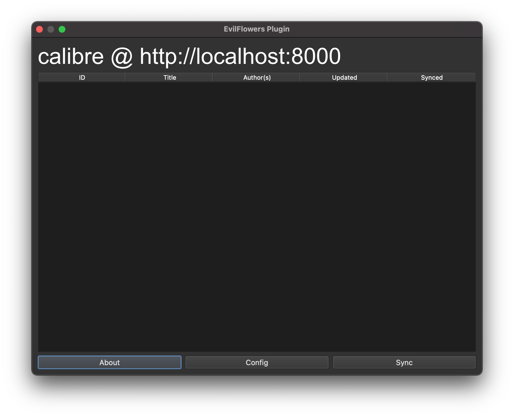

# Calibre EvilFlowers plugin

Calibre plugin for bidirectional synchronisation with [EvilFlowers](https://github.com/Sibyx/EvilFlowersCatalog)
OPDS server.

This project is heavily based on the [calibre-opds-client](https://github.com/goodlibs/calibre-opds-client) repository.
Many thanks for the inspiration.



## Progress

**Work in progress**

- [X] Config
- [X] API Client
- [ ] Main window
- [ ] Sync process

## Installation

[Calibre command-line tools](https://manual.calibre-ebook.com/generated/en/cli-index.html) have to be in your PATH.

```shell
cd calibre_plugin
calibre-customize -b .
```

## Debugging

Inside of `calibre_plugin` directory execute:

```shell
calibre-debug -s; calibre-customize -b . ; calibre
```

## Resources

- [Calibre: Creating plugins](https://manual.calibre-ebook.com/creating_plugins.html)
- [Calibre: Plugins](https://manual.calibre-ebook.com/plugins.html)
- [calibre-opds-client](https://github.com/goodlibs/calibre-opds-client)

---
Made with ❤️ 🍺 and ☕️ Jakub Dubec
